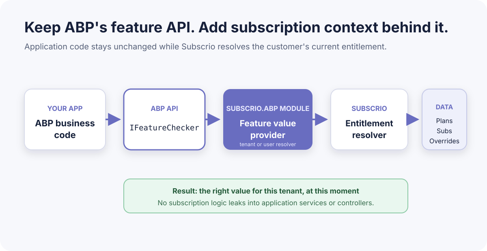

# Subscrio for ABP

[](https://github.com/subscrio/subscrio-abp/actions/workflows/ci.yml)

`Subscrio.Abp` connects ABP's `IFeatureChecker` to Subscrio subscription entitlements. Your application keeps defining and checking features through ABP. Subscrio supplies the value for the current tenant or user based on the customer's subscription, plan, and overrides.

[Subscrio website](https://subscrio.com) | [Main repository](https://github.com/subscrio/subscrio) | [Subscrio documentation](https://docs.subscrio.com)

For a walkthrough of the module, sample, and JSON catalog configuration, read [Enhancing ABP Feature Entitlements with Subscrio: Plans, Limits, and Overrides](docs/blog.md).

## How it works



1. Your code asks ABP for a feature through `IFeatureChecker`.
2. `SubscrioFeatureValueProvider` maps the current ABP tenant or user to a stable Subscrio customer key.
3. Subscrio resolves the customer's value. A customer override wins over the plan value, and the feature default is the fallback.
4. ABP returns the resolved value to your application.

ABP feature definitions remain the source of truth for feature names, types, and defaults. `AbpSubscrioFeatureCatalog` converts those definitions into Subscrio configuration when your application starts. Your application adds the products, plans, and plan values that belong to its business model.

## Install

The package targets .NET 8, .NET 9, and .NET 10.

```powershell
dotnet add package Subscrio.Abp
```

`Subscrio.Abp` and `Subscrio.Core` use the same package version.

## Configure an ABP application

Choose one customer identity module:

- `SubscrioAbpTenantModule` uses `ICurrentTenant.Id` for multi-tenant applications.
- `SubscrioAbpUserModule` uses `ICurrentUser.Id` when each authenticated user is a Subscrio customer.

Do not register both modules in the same application.

### Tenant-based applications

```csharp
[DependsOn(typeof(SubscrioAbpTenantModule))]
public sealed class AcmeModule : AbpModule
{
    public override void ConfigureServices(
        ServiceConfigurationContext context)
    {
        var configuration = context.Services.GetConfiguration();

        context.Services.AddSubscrio(
            new SubscrioConfig
            {
                Database = new DatabaseConfig
                {
                    ConnectionString =
                        configuration.GetConnectionString("Default")!,
                    DatabaseType = DatabaseType.SqlServer
                }
            },
            ServiceLifetime.Scoped);

        Configure<SubscrioAbpOptions>(options =>
        {
            options.ProductKey = "acme";
            options.IsManagedFeature = feature =>
                feature.Name.StartsWith(
                    "acme-",
                    StringComparison.Ordinal);
        });

        Configure<SubscrioAbpTenantOptions>(options =>
        {
            options.CustomerKeyFactory =
                tenantId => $"tenant-{tenantId:N}";
        });
    }
}
```

The customer key uses the tenant's immutable ID, so renaming a tenant does not change its Subscrio identity. When no tenant is active, the provider returns control to ABP's remaining feature value providers.

### User-based applications

Applications without tenants use the user module instead:

```csharp
[DependsOn(typeof(SubscrioAbpUserModule))]
public sealed class AcmeModule : AbpModule
{
    public override void ConfigureServices(
        ServiceConfigurationContext context)
    {
        Configure<SubscrioAbpUserOptions>(options =>
        {
            options.CustomerKeyFactory =
                userId => $"user-{userId:N}";
        });
    }
}
```

The user provider returns control to ABP when the request is anonymous. If neither identity model fits your application, implement `ISubscrioCustomerKeyResolver` and use the base `SubscrioAbpModule`.

## Define and synchronize features

Define features through ABP as usual:

```csharp
group.AddFeature(
    "acme-reports",
    defaultValue: "false",
    valueType: new ToggleStringValueType());

group.AddFeature(
    "acme-max-projects",
    defaultValue: "3",
    valueType: new FreeTextStringValueType(
        new NumericValueValidator(0, 10000)));
```

At application initialization, call `AbpSubscrioFeatureCatalog.GetFeaturesAsync()`, add the product and plan configuration, and pass the result to Subscrio's configuration sync. The complete implementation is in [`AcmeCatalogSynchronizer.cs`](src/Subscrio.Abp.Sample/AcmeCatalogSynchronizer.cs).

## Check feature values

Application code continues to use ABP:

```csharp
var reports = await featureChecker.IsEnabledAsync(
    "acme-reports");

var maxProjects = await featureChecker.GetAsync<int>(
    "acme-max-projects");
```

No Subscrio-specific check is needed in the application layer.

## Run the sample

The sample requires the [.NET 10 SDK](https://dotnet.microsoft.com/download/dotnet/10.0) and [SQL Server Express LocalDB](https://learn.microsoft.com/sql/database-engine/configure-windows/sql-server-express-localdb). It creates an ignored LocalDB database under the repository's `data` folder.

```powershell
git clone https://github.com/subscrio/subscrio-abp.git
cd subscrio-abp
dotnet run --project .\src\Subscrio.Abp.Sample
```

The console shows the complete resolution path:

```text
1. FEATURE DEFAULTS
────────────────────────────
Reports:       false
MaxProjects:   3

2. PRO PLAN VALUES
────────────────────────────
Reports:       true
MaxProjects:   100

3. CUSTOMER VALUES
────────────────────────────
Customer:      Acme Manufacturing
Plan:          Pro

Reports:       true
MaxProjects:   250   (customer override)

Resolved through ABP IFeatureChecker:
Reports:       true
MaxProjects:   250
```

Run the tests with:

```powershell
dotnet test .\Subscrio.Abp.Sample.slnx
```

The tests cover tenant and user customer keys, missing identity contexts, and invalid resolver registration.

## Repository layout

- `src/Subscrio.Abp` contains the reusable NuGet package.
- `src/Subscrio.Abp.Sample` contains the runnable LocalDB console sample.
- `tests/Subscrio.Abp.Tests` contains the integration tests.
- `docs/visuals` contains editable Mermaid diagrams and their SVG exports.

The Stripe diagram shows how an ABP web application can pass subscription events to Subscrio. The console sample does not include a payment provider or webhook endpoint.

## Project links

- [ABP feature documentation](https://abp.io/docs/latest/framework/infrastructure/features)
- [Subscrio feature resolution](https://docs.subscrio.com/reference/feature-checker/)
- [Subscrio configuration sync](https://docs.subscrio.com/reference/config-sync/)
- [Contributing](CONTRIBUTING.md)
- [Security policy](SECURITY.md)
- [MIT License](LICENSE)
