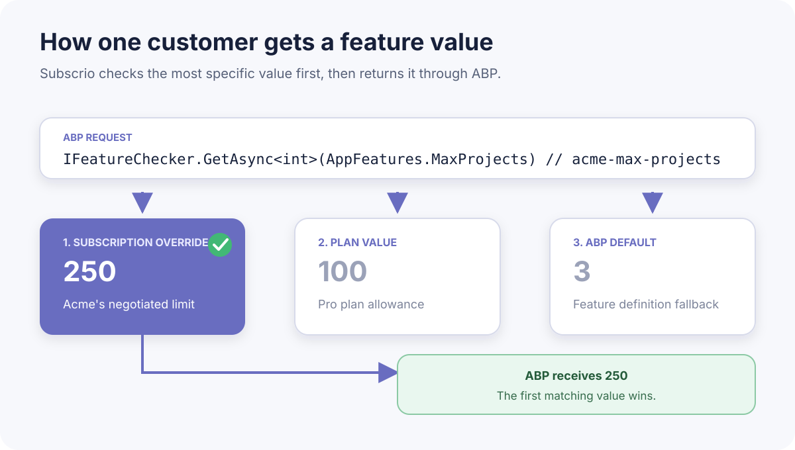
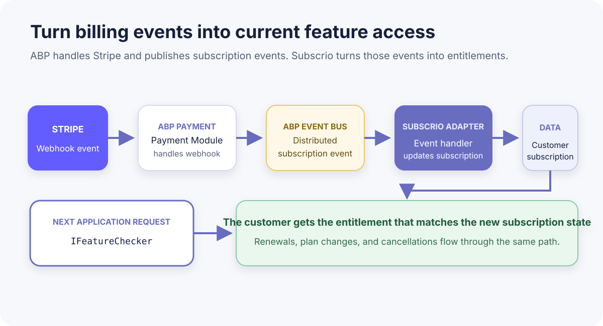

# Adding subscription entitlements to ABP with Subscrio

ABP already gives .NET applications a solid feature system. You define a feature once, then application code can ask whether it is enabled or retrieve a typed value through `IFeatureChecker`.

```csharp
var reports = await _featureChecker.IsEnabledAsync(
    AppFeatures.Reports);

var maxProjects = await _featureChecker.GetAsync<int>(
    AppFeatures.MaxProjects);
```

That API is a good fit for application code. It does not, by itself, describe which plan a customer bought, whether the subscription is active, or whether that customer negotiated a higher limit.

Subscrio supplies that subscription context without replacing ABP's feature API. The integration is a small ABP module that registers a custom feature value provider. An application can identify the Subscrio customer by its current ABP tenant or, when it does not use tenants, by its current authenticated user.

ABP documents both [`IFeatureChecker` and custom feature value providers](https://abp.io/docs/latest/framework/infrastructure/features?LanguageCode=en). The provider hook is what makes this integration small.


## The example

The sample uses one product with two plans:

| Feature | Free | Pro |
| --- | ---: | ---: |
| Reports | false | true |
| Maximum projects | 3 | 100 |

Acme Manufacturing subscribes to Pro. It also has a customer-specific override that raises its project limit from 100 to 250.

The complete, runnable source is in this repository. The solution contains:

- `Subscrio.Abp`, the reusable integration module
- `Subscrio.Abp.Sample`, the small Acme console application

The console host is intentional. ABP supports console applications, and the entitlement integration does not require controllers or a UI. The sample uses SQL Server Express LocalDB, so there is no Docker setup.

## Define the features in ABP

ABP remains the source of truth for feature names, types, and defaults. These are the constants used by the working sample:

```csharp
public static class AppFeatures
{
    public const string Reports = "acme-reports";
    public const string MaxProjects = "acme-max-projects";

    public static readonly string[] All =
        [Reports, MaxProjects];
}

public static class AppPlans
{
    public const string Free = "free";
    public const string Pro = "pro";
}

public static class AppProducts
{
    public const string Acme = "acme";
}
```

The sample deliberately uses Subscrio-safe keys in its ABP definitions. The same constant can then be used by both systems without a mapping table.

The feature definitions are ordinary ABP definitions:

```csharp
public sealed class AcmeFeatureDefinitionProvider
    : FeatureDefinitionProvider
{
    public override void Define(
        IFeatureDefinitionContext context)
    {
        var group = context.AddGroup(
            "Acme",
            new FixedLocalizableString("Acme"));

        group.AddFeature(
            AppFeatures.Reports,
            defaultValue: "false",
            displayName: new FixedLocalizableString("Reports"),
            valueType: new ToggleStringValueType());

        group.AddFeature(
            AppFeatures.MaxProjects,
            defaultValue: "3",
            displayName:
                new FixedLocalizableString("Maximum projects"),
            valueType: new FreeTextStringValueType(
                new NumericValueValidator(0, 10000)));
    }
}
```

ABP discovers `FeatureDefinitionProvider` classes automatically. Its [feature documentation](https://abp.io/docs/latest/framework/infrastructure/features?LanguageCode=en) covers toggle and numeric feature definitions in more detail.

## Add the Subscrio ABP module

The generic integration code lives in `Subscrio.AbpModule`. An application adds that module as a dependency, registers Subscrio, and supplies the small amount of application-specific information the provider needs:

```csharp
[DependsOn(
    typeof(AbpAutofacModule),
    typeof(SubscrioAbpTenantModule)
)]
public sealed class AbpSubscrioSampleModule : AbpModule
{
    public override void ConfigureServices(
        ServiceConfigurationContext context)
    {
        context.Services.AddSubscrio(
            new SubscrioConfig
            {
                Database = new DatabaseConfig
                {
                    ConnectionString =
                        LocalDbDatabase.ConnectionString,
                    DatabaseType = DatabaseType.SqlServer,
                    Ssl = false
                }
            },
            ServiceLifetime.Scoped);

        context.Services.AddTransient<AcmeCatalogSynchronizer>();
        context.Services.AddTransient<DemoDataSeeder>();
        context.Services.AddTransient<DemoRunner>();

        Configure<SubscrioAbpOptions>(options =>
        {
            options.ProductKey = AppProducts.Acme;
            options.FeatureGroupName = "Acme";
            options.IsManagedFeature = feature =>
                AppFeatures.All.Contains(
                    feature.Name,
                    StringComparer.Ordinal);
            options.FeatureDisplayNameFactory =
                feature => feature.Name switch
                {
                    AppFeatures.Reports => "Reports",
                    AppFeatures.MaxProjects =>
                        "Maximum projects",
                    _ => feature.Name
                };
        });

        Configure<SubscrioAbpTenantOptions>(options =>
        {
            options.CustomerKeyFactory =
                AppTenants.GetCustomerKey;
        });
    }
}
```

ABP's [module system](https://abp.io/docs/latest/framework/architecture/modularity/basics) handles the dependency and initialization order. The reusable module registers the feature value provider with `AbpFeatureOptions`, so the application does not need to register that class itself.

`SubscrioAbpOptions` keeps the reusable code independent of Acme. Another application can select a different product, use a different feature filter, or map legacy feature names. Customer identity is configured by the tenant or user module described below.

## Build the Subscrio catalog from ABP

The module includes `AbpSubscrioFeatureCatalog`. It reads ABP's registered definitions and converts the managed ones into Subscrio `FeatureConfig` records. Toggle, numeric, and text value types are mapped in one place.

The Acme application then adds the commercial structure:

```csharp
var features = await _featureCatalog.GetFeaturesAsync();

var config = new ConfigSyncDto(
    Version: DemoCatalog.Version,
    Features: features.ToList(),
    Products:
    [
        new ProductConfig(
            Key: AppProducts.Acme,
            DisplayName: "Acme",
            Description:
                "The demo product used by the ABP and " +
                "Subscrio integration sample.",
            Features: features
                .Select(feature => feature.Key)
                .ToList(),
            Plans:
            [
                new PlanConfig(
                    Key: AppPlans.Free,
                    DisplayName: "Free",
                    Description: "The default Acme plan.",
                    FeatureValues: new Dictionary<string, string>
                    {
                        [AppFeatures.Reports] = "false",
                        [AppFeatures.MaxProjects] = "3"
                    },
                    BillingCycles:
                    [
                        new BillingCycleConfig(
                            Key: DemoCatalog.FreeBillingCycleKey,
                            DisplayName: "Free monthly",
                            DurationValue: 1,
                            DurationUnit: "months")
                    ]),

                new PlanConfig(
                    Key: AppPlans.Pro,
                    DisplayName: "Pro",
                    Description: "The paid Acme plan.",
                    FeatureValues: new Dictionary<string, string>
                    {
                        [AppFeatures.Reports] = "true",
                        [AppFeatures.MaxProjects] = "100"
                    },
                    BillingCycles:
                    [
                        new BillingCycleConfig(
                            Key: DemoCatalog.ProBillingCycleKey,
                            DisplayName: "Pro monthly",
                            DurationValue: 1,
                            DurationUnit: "months")
                    ])
            ])
    ]);

var report = await subscrio.ConfigSync
    .SyncFromJsonAsync(config);
```

The sample runs this synchronization from ABP's asynchronous application initialization lifecycle:

```csharp
public override async Task OnApplicationInitializationAsync(
    ApplicationInitializationContext context)
{
    await LocalDbDatabase.EnsureCreatedAsync();

    var subscrio = context.ServiceProvider
        .GetRequiredService<Subscrio.Core.Subscrio>();

    if (await subscrio.VerifySchemaAsync() is null)
    {
        await subscrio.InstallSchemaAsync();
    }

    await subscrio.MigrateAsync();

    var synchronizer = context.ServiceProvider
        .GetRequiredService<AcmeCatalogSynchronizer>();

    await synchronizer.SyncAsync(subscrio);

    var seeder = context.ServiceProvider
        .GetRequiredService<DemoDataSeeder>();

    await seeder.SeedAsync(subscrio);
}
```

ABP documents the [application initialization lifecycle](https://abp.io/docs/latest/framework/architecture/modularity/basics#application-initialization). For a larger deployment, schema migration and catalog sync may belong in a deployment job rather than every application instance. The integration itself stays the same.

## Choose how customers are identified

The integration includes two customer resolvers. An application should select one.

### Tenant-based applications

ABP's `ICurrentTenant` exposes the current tenant's immutable `Guid`. The sample turns it into a stable Subscrio customer key:

```csharp
public static class AppTenants
{
    public static string GetCustomerKey(Guid tenantId) =>
        $"tenant-{tenantId:N}";
}
```

The mapping does not use the tenant name. Renaming Acme Manufacturing therefore does not change its Subscrio identity. ABP's [multi-tenancy documentation](https://abp.io/docs/latest/framework/architecture/multi-tenancy) explains how the current tenant is resolved in an application.

The application selects this resolver by depending on `SubscrioAbpTenantModule`:

```csharp
[DependsOn(typeof(SubscrioAbpTenantModule))]
public sealed class AcmeModule : AbpModule
{
    public override void ConfigureServices(
        ServiceConfigurationContext context)
    {
        Configure<SubscrioAbpTenantOptions>(options =>
        {
            options.CustomerKeyFactory =
                tenantId => $"tenant-{tenantId:N}";
        });
    }
}
```

When ABP is running in its host context and `ICurrentTenant.Id` is empty, the resolver returns `null`. ABP can then continue to its next feature value provider.

### Applications without tenants

A non-tenant application can treat each authenticated user as a Subscrio customer. It depends on `SubscrioAbpUserModule` instead:

```csharp
[DependsOn(typeof(SubscrioAbpUserModule))]
public sealed class AcmeModule : AbpModule
{
    public override void ConfigureServices(
        ServiceConfigurationContext context)
    {
        Configure<SubscrioAbpUserOptions>(options =>
        {
            options.CustomerKeyFactory =
                userId => $"user-{userId:N}";
        });
    }
}
```

`CurrentUserSubscrioCustomerKeyResolver` reads `ICurrentUser.Id`. It returns `null` for an anonymous request. The rest of the integration is unchanged: the same provider, catalog synchronization, plans, overrides, and `IFeatureChecker` calls are used in both modes.

Applications with another customer identity model can implement `ISubscrioCustomerKeyResolver` and register it with the base `SubscrioAbpModule`.

## Resolve a real customer's entitlement

The seed data creates this state:

```text
Customer
  Name: Acme Manufacturing
  Key:  tenant-7f8d1c405f184ba8879f5f5e8e49d9f1

Subscription
  Product: Acme
  Plan:    Pro
  Status:  Active

Pro plan
  acme-reports:      true
  acme-max-projects: 100

Customer override
  acme-max-projects: 250
```

Subscrio resolves the customer override before the plan value and feature default.



The application still asks ABP:

```csharp
using (_currentTenant.Change(
    DemoCatalog.TenantId,
    "Acme Manufacturing"))
{
    var reports = await _featureChecker.IsEnabledAsync(
        AppFeatures.Reports);

    var maxProjects = await _featureChecker.GetAsync<int>(
        AppFeatures.MaxProjects);
}
```

`SubscrioFeatureValueProvider` asks the selected customer resolver for a key and requests the entitlement from Subscrio. In this tenant-based sample, the resolved values are `true` and `250`.

That is the useful boundary. Application services do not need to inspect plans, subscription periods, or overrides.

## Run it

The sample requires the .NET 10 SDK and SQL Server Express LocalDB. It does not require Docker.

```powershell
cd subscrio-abp
dotnet restore
dotnet run --project .\src\Subscrio.Abp.Sample
```

The output makes each stage visible:

```text
1. FEATURE DEFAULTS
────────────────────────────
Reports:       false
MaxProjects:   3

2. PRO PLAN VALUES
────────────────────────────
Reports:       true
MaxProjects:   100

3. CUSTOMER VALUES
────────────────────────────
Customer:      Acme Manufacturing
Plan:          Pro

Reports:       true
MaxProjects:   250   (customer override)

Resolved through ABP IFeatureChecker:
Reports:       true
MaxProjects:   250
```

Run it a second time and the catalog report should show zero created and zero updated records. The initialization is idempotent.

The repository also tests both customer resolvers:

```powershell
dotnet test .\Subscrio.Abp.Sample.slnx
```

Those tests cover a current tenant, an empty host context, a current authenticated user, and an anonymous request.

## Where Stripe fits

ABP's commercial [Payment Module](https://abp.io/docs/latest/modules/payment) supports Stripe subscriptions, receives Stripe webhooks, and publishes distributed events for subscription lifecycle changes. In a web application that uses that module, a Subscrio event handler can translate those ABP events into customer subscription updates.



The console sample does not reference the commercial Payment Module and does not pretend to host an HTTP webhook. The Stripe path is an optional web-host extension:

```text
Stripe webhook
    → ABP Payment Module
    → ABP distributed subscription event
    → Subscrio event handler
    → customer subscription update
```

The handler must be idempotent because webhook and distributed-event delivery may be repeated. It should reuse the same customer and plan keys as the tested console integration.

## What belongs where

ABP defines the capabilities and gives application code a stable feature API. The reusable `Subscrio.Abp` module connects that API to Subscrio. The application defines how its features are packaged into products and plans. Subscrio owns subscription state and entitlement resolution.

The working repository is the source for every implementation snippet in this article. If the integration changes, the sample should be changed and tested first, then the article should copy the updated code.
